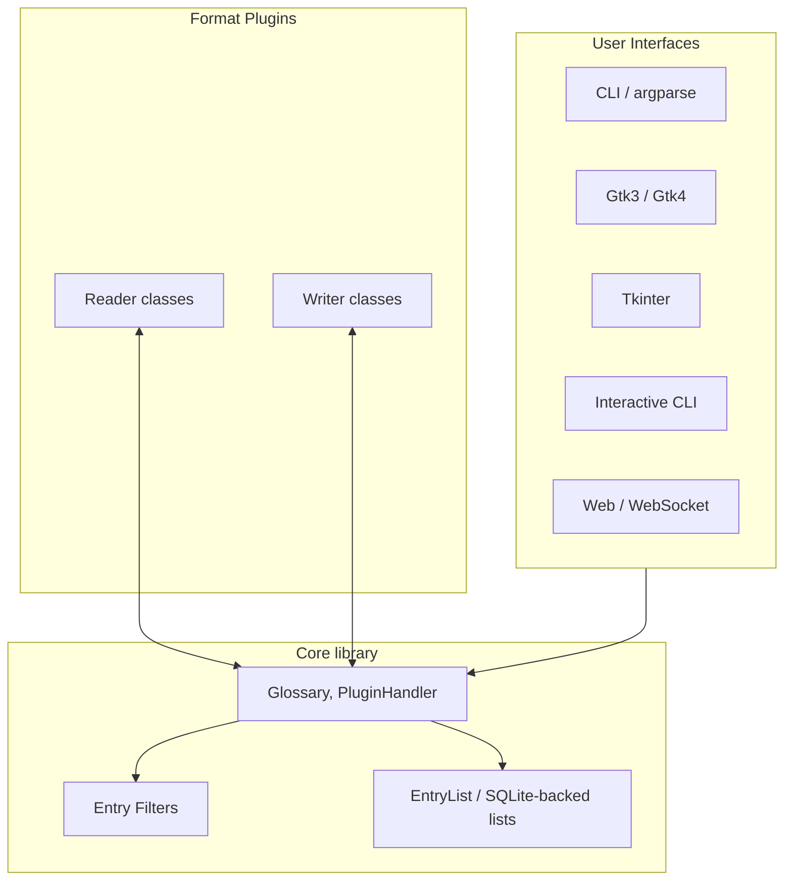

# PyGlossary architecture

This document is a **map of the codebase** for contributors and advanced users. User-facing behavior, installation, and format tables live in [README.md](README.md). Day-to-day contribution workflow is in [CONTRIBUTING.md](CONTRIBUTING.md).

## What the program does

PyGlossary converts **dictionary glossaries** between many file formats. Conceptually it always moves data through a common internal representation: **entries** (terms + definitions, plus optional **data entries** for assets) that **readers** produce and **writers** consume. Optional **entry filters** sit between reader output and writer input.

## Layers (high level)

Interfaces differ in how they collect paths, formats, and options, but they converge on the same **`pyglossary.glossary_v2.Glossary`** API for **read → transform → write**.

## Repository layout

| Area | Role |
| ---- | ---- |
| [`pyglossary/glossary_v2.py`](pyglossary/glossary_v2.py) | Canonical **`Glossary`** type: conversion orchestration, `ConvertArgs`, direct/indirect reading, SQLite mode, progress hooks. |
| [`pyglossary/glossary.py`](pyglossary/glossary.py) | Legacy **`Glossary`** subclass kept for compatibility; new code should use **`glossary_v2.Glossary`**. |
| [`pyglossary/plugin_handler.py`](pyglossary/plugin_handler.py) | Discovers plugins, maps extensions to formats, loads **`PluginProp`** metadata. |
| [`pyglossary/plugin_prop.py`](pyglossary/plugin_prop.py) | Describes one format plugin: name, extensions, options, lazy **`Reader`** / **`Writer`** classes, optional dependencies. |
| [`pyglossary/plugins/`](pyglossary/plugins/) | One package per format (typically **`__init__.py`** with module-level metadata plus **`reader.py`** / **`writer.py`** as needed). |
| [`plugins-meta/index.json`](plugins-meta/index.json) | Generated catalog of plugins so UIs can list formats **without importing every plugin** at startup. |
| [`pyglossary/ui/`](pyglossary/ui/) | All front ends: shared argparse wiring, then per-UI modules (`ui_cmd`, `ui_gtk3`, `ui_gtk4`, `ui_tk`, `ui_cmd_interactive`, `ui_web`, …). |
| [`pyglossary/core.py`](pyglossary/core.py) | Version, paths (`pluginsDir`, `cacheDir`, config locations), shared logging helpers. |
| [`pyglossary/entry.py`](pyglossary/entry.py), [`pyglossary/entry_filters.py`](pyglossary/entry_filters.py) | Entry model and configurable filters applied along the pipeline. |
| [`pyglossary/xdxf/`](pyglossary/xdxf/) | XDXF-related transforms used where definitions use that format. |
| [`doc/`](doc/) | User and contributor documentation; per-format pages under [`doc/p/`](doc/p/) are largely **generated** from plugin metadata. |
| [`tests/`](tests/) | `unittest`-based tests; many are named by format (`g_*_test.py`). |
| [`scripts/gen`](scripts/gen) | Regenerates `plugins-meta/index.json`, `doc/p/*.md`, and related outputs after plugin changes. |

## Entry model and filters

The internal shape of an entry (headword, alternates, definition text vs HTML/XDXF, data blobs) is summarized in [**doc/internals.md**](doc/internals.md). Entry filters and flags are documented in [**doc/entry-filters.md**](doc/entry-filters.md) and configuration in [**doc/config.rst**](doc/config.rst).

## Plugin system

1. **Discovery**: At startup, **`PluginHandler`** loads plugin metadata from **`plugins-meta/index.json`** for speed. In high-verbosity modes, plugins may be loaded from the filesystem directly (see **`PluginLoader`** in [`plugin_handler.py`](pyglossary/plugin_handler.py)).
1. **Contract**: Each enabled plugin exposes module-level fields (`enable`, `lname`, `name`, `extensions`, …) and optionally **`Reader`** / **`Writer`** classes with declared read/write options and PyPI dependencies. Details and the table of metadata names are in [CONTRIBUTING.md — Plugins and generated files](CONTRIBUTING.md#plugins-and-generated-files).
1. **Regeneration**: After changing a plugin’s public metadata or options, run **`./scripts/gen`** and commit the updated generated files so CI stays green.

## Entry points

- **Console script**: `pyglossary` → [`pyglossary.ui.main:main`](pyglossary/ui/main.py) (same as repo-root [`main.py`](main.py) for development runs).
- **Utilities**: `pyglossary-diff`, `pyglossary-view` (see [`pyproject.toml`](pyproject.toml) `[project.scripts]`).

`ui/main.py` sets up logging, parses arguments, selects a UI implementation, and hands off to format-specific code only through the shared **`Glossary`** / plugin APIs.

## Library usage

Embedding PyGlossary in other Python code is described in [**doc/lib-usage.md**](doc/lib-usage.md) and examples under [**doc/lib-examples/**](doc/lib-examples/).

## Further reading

| Topic | Document |
| ----- | -------- |
| Contributor setup, tests, Ruff, `scripts/gen` | [CONTRIBUTING.md](CONTRIBUTING.md) |
| Entry structure, filters (short internal reference) | [doc/internals.md](doc/internals.md), [doc/entry-filters.md](doc/entry-filters.md) |
| Configuration reference | [doc/config.rst](doc/config.rst) |
| Direct vs indirect mode, SQLite mode, sorting (user-oriented) | [README.md](README.md) |
| Minimal plugin examples | [pyglossary/plugins/testformat/](pyglossary/plugins/testformat/), [pyglossary/plugins/csv_plugin/](pyglossary/plugins/csv_plugin/) |
